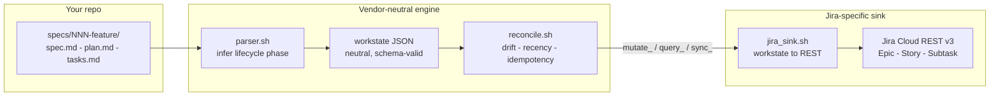
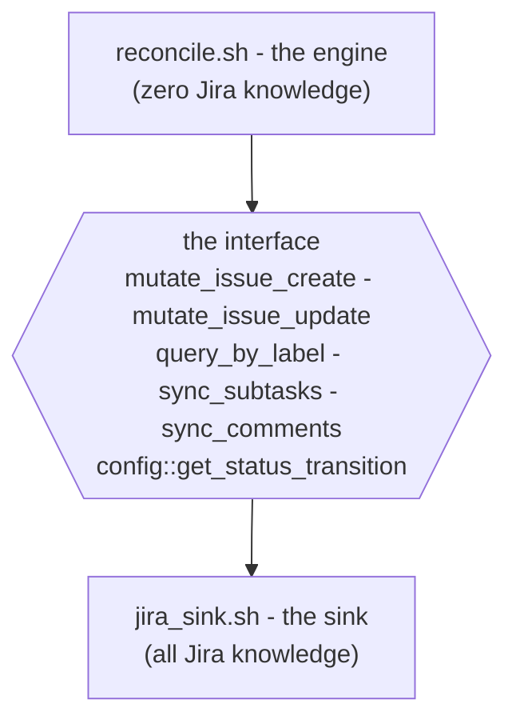
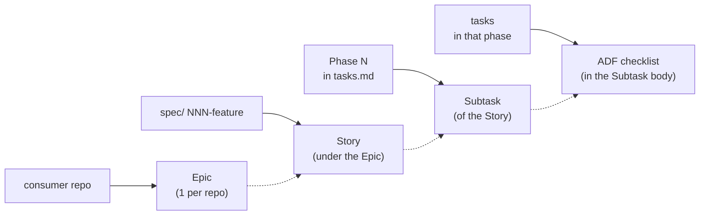
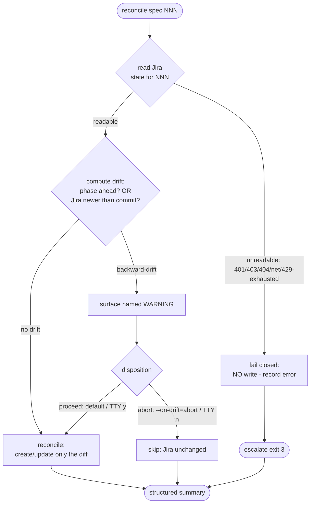
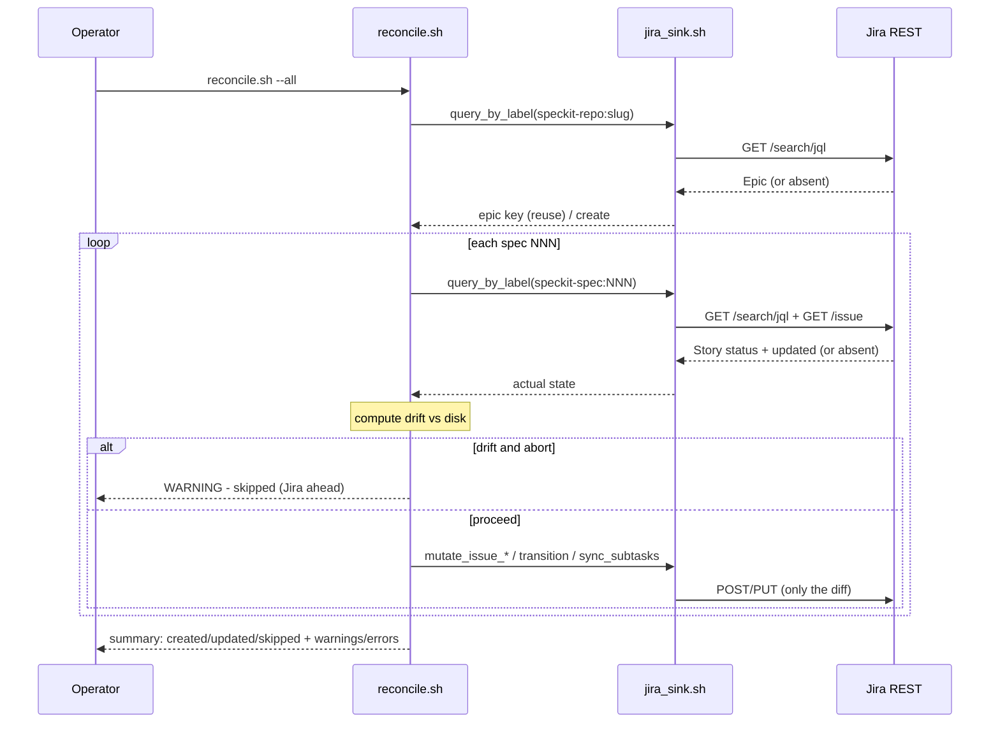

<div align="center">

# spec-kit-jira

**A real sync engine that mirrors your spec-kit specs into Jira — idempotent, drift-aware, and fail-closed.**

[](#status--roadmap)
[](#status--roadmap)
[](#how-it-works)
[](LICENSE)
[](#privacy)

</div>

Point it at a spec-kit repository, run one command, and every feature under
`specs/NNN-feature/` shows up in Jira — grouped under a single per-repo **Epic**,
one **Story** per spec, a **Subtask** per task phase, with the phase's tasks
rendered as a checklist. Re-run it as often as you like: an unchanged corpus
produces **zero** writes.

---

## Not a prompt that POSTs to your board

The honest competitor in this space is a markdown command file that tells an
agent "read the checkboxes and POST them to Jira." That works exactly once, on a
clean board, with a patient operator watching. It has no idempotency (re-running
duplicates issues), no drift detection (it clobbers whatever a teammate
advanced), and no failure contract (a 401 mid-run leaves a half-mirrored board).

`spec-kit-jira` is the other thing — a **reconcile engine**, built the way
Kubernetes builds controllers: it reads the full desired state off disk, reads
the actual state from Jira, computes the difference, and writes only that. The
three properties that fall out of that design are the whole pitch:

| Property | What it means | Why a prompt can't promise it |
|---|---|---|
| **Idempotent** | Re-running against an unchanged corpus performs zero writes — no duplicate Epic, no rewritten fields, no re-posted comments. | A prompt re-creates whatever it's told to create; it has no model of "already there." |
| **Drift-aware** | When Jira is *ahead* of disk (someone advanced the Story), the engine surfaces a named WARNING and asks before overwriting — it never silently regresses your board. | A prompt has no notion of "Jira is further along than my file." |
| **Fail-closed** | If Jira can't be read reliably (auth, network, deleted issue, sustained 429), the engine writes **nothing** for that spec, reports it, and exits non-zero. | A prompt that can't read just guesses, or writes partial garbage. |

> The filesystem is the single source of truth. Jira is a unidirectional,
> read-only mirror. Edit a Story in Jira and the next reconcile restores the
> disk-derived state — after telling you it found drift.

---

## How it works

The pipeline is deliberately split into a **vendor-neutral engine** and a
**Jira-specific sink**, joined by one interface:



1. **Parse.** `parser.sh` reads each `specs/NNN-feature/` directory and infers
   the lifecycle phase from which artifacts exist and what they contain — no
   operator annotation required.
2. **Neutralize.** The parser emits **`workstate`** — a neutral, schema-valid
   JSON document. The engine and sink never model Jira directly; they pass
   `workstate` items around. Every emitted document is validated against the
   published `workstate.schema.json` (Draft 2020-12) before any write.
3. **Reconcile.** `reconcile.sh` (the engine, copied vendor-neutral from the
   shipped `spec-kit-linear`) computes per-spec drift and recency, then drives
   writes through a fixed set of `mutate_*` / `query_*` / `sync_*` functions.
4. **Sink.** `jira_sink.sh` implements that interface against Jira Cloud REST —
   idempotency lookups by label, ADF body rendering, transition POSTs, and the
   bounded 429-backoff fail-closed read path.

### The `workstate` contract — and why this repo exists

`workstate` is a **tracker-agnostic interchange format** owned by a separate
schema repo. The deal is: a *producer* emits `workstate`; any *sink* consumes
it. The Jira sink reads only documented `workstate` fields and ignores unknown
`extensions` keys (so the format can grow without breaking sinks).

This repo is the **independent second consumer** that *proves* `workstate` is
genuinely neutral. A from-scratch Jira sink that eats the same `workstate` a
Linear-targeted tool produces is the validation that the format wasn't secretly
shaped to one vendor. The clean engine/sink seam is also what lets the two tools
later collapse into one shared engine plus per-tracker sinks.

### The engine vs sink seam



`config::get_status_transition` (lifecycle phase → Jira status + transition id)
is the single vendor lever. Swap the sink and the same engine drives a different
tracker — that is the whole point of keeping Jira specifics out of the engine.

---

## What lands in Jira

spec-kit artifacts map to Jira primitives:



| On disk | Jira primitive | Idempotency key |
|---|---|---|
| Consumer repository | **Epic** (1 per repo, reused across runs) | label `speckit-repo:<slug>` |
| Spec (`specs/NNN-feature/`) | **Story** under the repo Epic | label `speckit-spec:NNN` |
| Lifecycle phase | Story **status** (set via a transition POST) + `phase:*` label | config `phase→status` map |
| Task phase (`## Phase N`) | **Subtask** of the Story | parent + `task-phase:N` label |
| Tasks within a phase | **ADF checklist** in the Subtask body | content diff |
| Clarification / decision sessions | **comments** | marker prefix → at-most-once |
| Cross-spec dependencies | **issue links** | `(rel, target)` → at-most-once |

The ADF checklist is today's default. Configurable artifact mapping and a
**2-level mode** (collapse tasks into a Story-body checklist instead of separate
Subtask issues) are on the [roadmap](#status--roadmap).

---

## The reconcile decision flow

For every spec, the engine decides — per spec, independently — whether and how
to write. It never silently clobbers, and it fails closed when it can't read:



A single reconcile run, end to end:



The run summary drives the process **exit code** by monotonic escalation: the
highest code that fires wins.

---

## Quick start

### Prerequisites

- Runtime: `bash` 4.4+, `curl`, `jq`, `git`, `gh`
- Dev/CI: `bats`, `shellcheck`, `yamllint`, `markdownlint-cli2`, and
  [`uv`](https://docs.astral.sh/uv/) (preferred — PEP 668-safe) for `workstate`
  schema validation

### Configure the two gitignored files

Credentials and the per-project binding live **only** in gitignored files —
never in the tracked tree (Principles VI + IX).

`.env` — the Jira Cloud Basic-auth credential:

```bash
JIRA_BASE_URL=https://<your-site>.atlassian.net
JIRA_EMAIL=<you@example.com>
JIRA_API_TOKEN=<atlassian-api-token>   # never commit; .env is gitignored
```

`.specify/extensions/jira/jira-config.yml` — the resolved per-project binding
(project key, issue-type / status / transition ids). Copy the committed
placeholder [`config-template.yml`](config-template.yml) to that gitignored
location and fill in your real ids. (Auto-resolving them is the seed/install
feature; for now you fill them by hand or read them off the project via the
Atlassian MCP — see [`dogfood.md`](specs/001-core-bridge/dogfood.md).)

### Dry-run first — preview every write, touch nothing

```bash
src/reconcile.sh --all --dry-run
```

This reports every intended create / update / transition / comment without
calling Jira. The preview's reported actions match what a subsequent live run
performs (SC-007). Inspect the summary, then drop `--dry-run`:

```bash
src/reconcile.sh --all                     # reconcile every spec
src/reconcile.sh --spec 001                # reconcile only feature 001
src/reconcile.sh --all --on-drift=abort    # never overwrite a drifted issue
```

### Command surface

```text
reconcile.sh [--spec NNN | --all] [--dry-run] [--on-drift=proceed|abort]
             [--quiet] [--config PATH]
```

| Flag | Meaning |
|---|---|
| `--all` | Reconcile every spec under `specs/` (default if no `--spec`). |
| `--spec NNN` | Reconcile only feature NNN. |
| `--dry-run` | Compute and report every intended write; perform none. |
| `--on-drift=proceed\|abort` | Non-interactive disposition on backward-drift; default proceed-and-warn. |
| `--quiet` | Suppress per-mutation logging; the summary still prints. |
| `--config PATH` | Override the gitignored `jira-config.yml` location. |

### Exit codes (monotonic escalation)

| Code | Meaning |
|---|---|
| **0** | Success; all processable specs reconciled (or nothing to do). |
| **1** | Completed with per-spec warnings (drift surfaced, missing `tasks.md`). |
| **2** | Project-level configuration error (no/invalid binding) — run halted. |
| **3** | One or more specs failed closed (unreadable Jira, exhausted 429 retries). |

The highest code that fires wins. See
[`quickstart.md`](specs/001-core-bridge/quickstart.md) for setup and running the
tests, and [`dogfood.md`](specs/001-core-bridge/dogfood.md) for self-provisioning
this repo against a real Jira project.

---

## Configuration

The per-project binding is `jira-config.yml`, resolved once and stored gitignored
(real ids never enter the tree). Its shape is documented in the committed
placeholder [`config-template.yml`](config-template.yml):

```yaml
jira:
  project_key: "PROJ"           # placeholder — the prefix in every issue key
  issue_types:                  # numeric ids, NOT names
    epic: "10001"
    story: "10002"
    subtask: "10003"
  phase_status:                 # lifecycle phase -> target status id (via a transition)
    specifying: "20001"
    planning: "20002"
    tasking: "20003"
    implementing: "20004"
    ready_to_merge: "20005"
    merged: "20006"
  transitions: {}               # optional explicit transition ids; else resolved by target status
  labels:                       # operator-chosen prefixes carrying idempotency identity
    spec_prefix: "speckit-spec:"
    repo_prefix: "speckit-repo:"
    phase_prefix: "task-phase:"
    lifecycle_prefix: "phase:"
```

Every identifier is a **stable id**, never an operator-editable display name
(Principle V) — renaming a status in Jira's UI never breaks the bridge. A
missing or unreadable binding is a project-level configuration error that halts
the run (exit 2), distinct from a per-spec failure.

---

## Status & roadmap

**In active development — not yet released.** This section is honest about what
is built versus planned. The suite is **175+ bats tests**, cross-model reviewed
at phase boundaries, run against a mocked Jira REST harness (a `curl`-shim that
returns fixture JSON keyed by method + URL).

### Done — mock-validated

- **US1 · Fresh mirror** — a first run creates the per-repo Epic, one Story per
  spec under it, and a Subtask per task phase with each phase's tasks rendered as
  a done/not-done ADF checklist.
- **US2 · Idempotent zero-churn re-run** — a second run against an unchanged
  corpus performs zero writes, reuses the existing Epic, and reconciles a
  disk-authoritative Story status back to the derived value.
- **US3 · Drift read** — a Story ahead of disk (by lifecycle order or commit
  recency) surfaces a named backward-drift warning; it never silently clobbers.
- **US4 · Lifecycle & content propagation** — status transitions, new Subtasks,
  clarification comments, and cross-spec issue links, each created at most once.
- **US5 · Fail-closed & observable** — unreadable Jira, missing artifacts, and
  sustained 429 each fail closed for the affected spec and surface in the
  structured summary.
- **Vendor-neutral reconcile engine** — drift detection, commit-recency gating,
  layered idempotency, kept free of any Jira specifics.
- **`workstate` schema gate** — every emitted record validated against the
  published schema (under `uv`, PEP 668-safe) before any write.

### Roadmap

- A **live-instance run** beyond the mocked REST harness.
- **Configurable artifact/relationship mapping** + a **2-level mode** (collapse
  tasks into a Story-body checklist instead of separate Subtask issues).
- Exposing **`workstate` as a direct input** (run the sink from a `workstate`
  file/stdin, skipping the parser) so any producer can feed it.
- **Carving the parser out** into a standalone `workstate` producer, leaving this
  repo a pure `workstate → Jira` consumer.
- **Engine extraction** — collapsing the engine shared with `spec-kit-linear`
  into one package with per-tracker sinks.
- Layer E (the real-time GitHub Action status flips) and seed/install ergonomics.

---

## Privacy

This is a public repository. **No real Jira coordinate ever enters a tracked
file** — no workspace, site, project key, account id, cloudId/UUID, email, or
API token. Documentation and fixtures use placeholders only (e.g.
`https://<your-site>.atlassian.net`, `PROJ`).

Real values live exclusively in gitignored files — `.env`, `jira-config.yml`,
and `tests/.private-deny` — and the privacy guard
(`tests/unit/no-real-identifiers.bats`) scans the tracked tree and gates CI on
any shape-based or operator-literal leak (Principle IX).

---

## Development

Run the exact CI gate locally before pushing:

```bash
scripts/check.sh                                # mirrors all CI jobs
# or individually:
shellcheck --shell=bash --severity=style src/*.sh
yamllint -d relaxed .github/workflows/ci.yml
npx --yes markdownlint-cli2 "specs/**/*.md" "*.md"
bats --recursive tests/unit                     # offline, curl-shim mocked
RUN_INTEGRATION_TESTS=1 bats tests/integration  # needs a real binding + .env
```

See [CONTRIBUTING.md](CONTRIBUTING.md) for the full contribution workflow.
Project governance — the non-negotiable principles every spec and PR is checked
against — lives in
[`.specify/memory/constitution.md`](.specify/memory/constitution.md) (v1.0.0).

---

## Related work

- **Spec Kit core** — <https://github.com/github/spec-kit>
- **Sibling bridge** — `spec-kit-linear`, the shipped twin targeting Linear; the
  reconcile engine here is copied from it and kept vendor-neutral.
- **Sibling extension** — `spec-kit-red-team`, adversarial spec review before
  `/speckit.plan` locks in architecture.
- **`workstate`** — the neutral interchange schema this repo proves as an
  independent second consumer.

## License

MIT — see [LICENSE](LICENSE).
